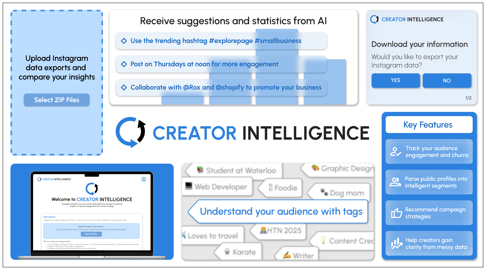
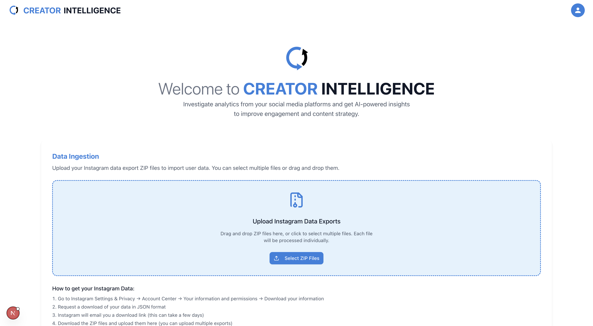
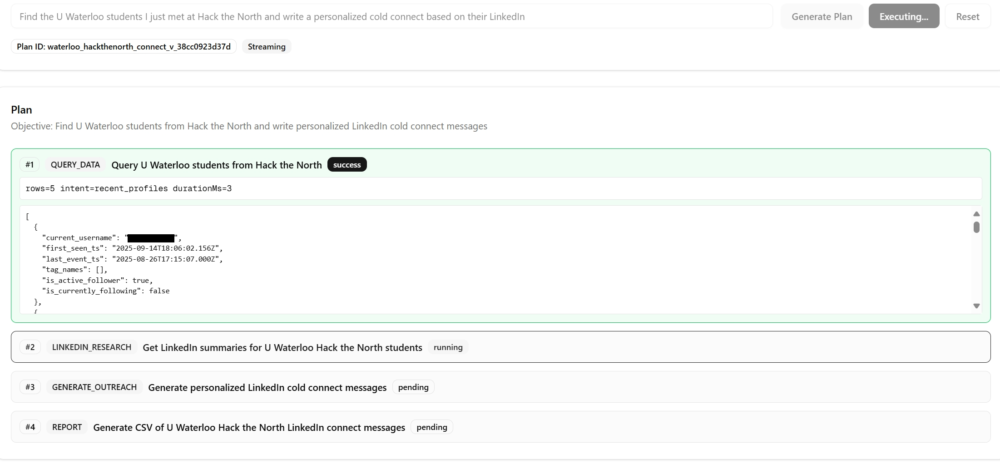
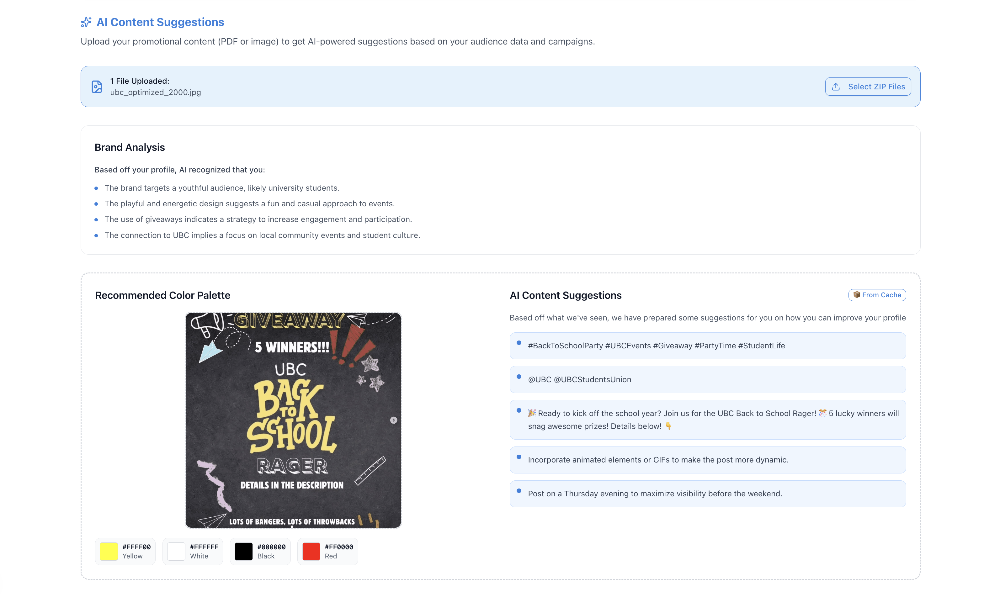
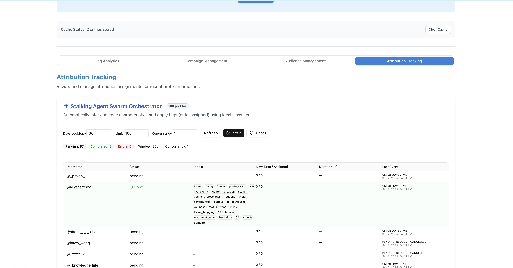
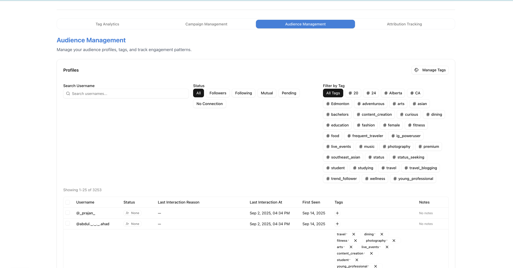
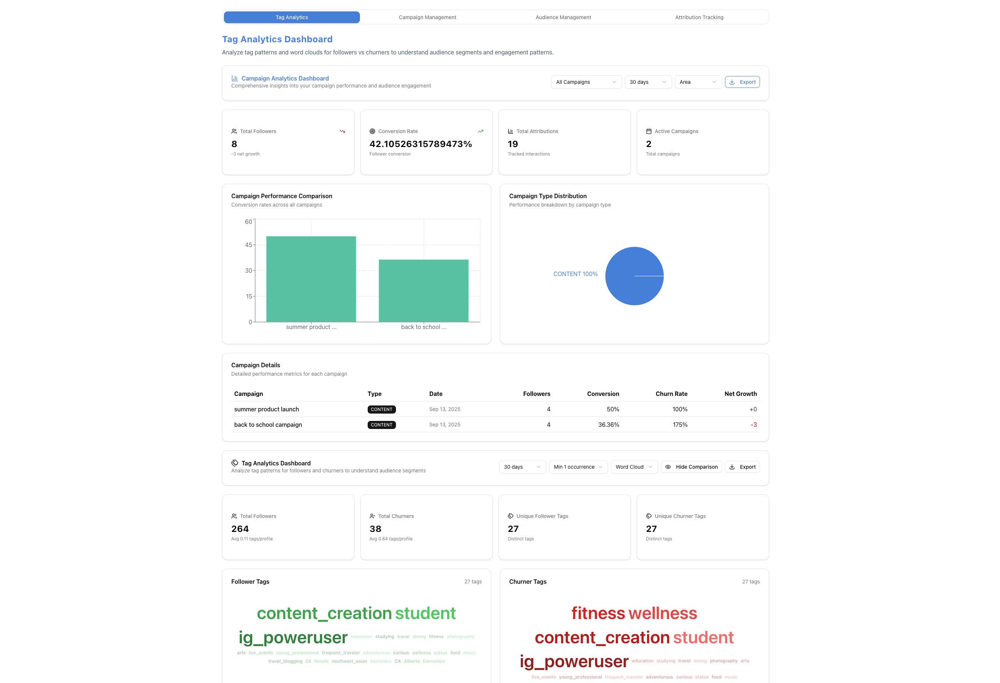
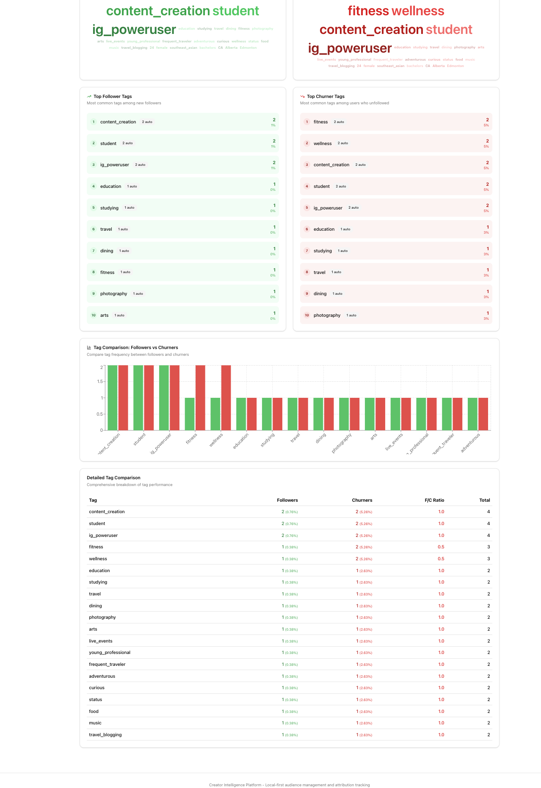

## Inspiration  
Every day, millions of creators pour their hearts into building content and growing their presence, whether for personal expression or business. But when it comes to understanding their audience, they’re flying blind.

While SaaS companies rely on CRMs and data dashboards, creators are stuck with surface-level platform insights. They can see follower counts go up or down—but not **who**, **why**, or **what it means**.

Therefore, we asked: what if creators had a **personal CRM**, powered by AI, that helps them track engagement, flag churn risks, and identify revenue opportunities?

That’s the goal of our project: to build an **Agentic Creator Intelligence Platform** that gives creators full control over their audience data and leverages autonomous agents to generate strategic insights and recommendations.

## How it works and Key Features  
Creator Intelligence is a platform that brings Agentic CRM vision to the content creation world. It is a web app that ingests user profile data and activates AI Agents to: 

- Track audience engagement and churn  
- Attribute follower changes to specific campaigns  
- Parse public profiles into intelligent segments  
- Recommend campaign strategies  
- Help creators gain clarity from messy structured and unstructured data

<table style="max-width: 800px; margin: auto;">
    <tr>
        <th>Screenshots</th>
    </tr>
    <tr>
        <td>
             
            
<em>Figure 1 — Instagram messy data ingestion</em>

        </td>
    </tr>
    <tr>
        <td>
             
            
<em>Figure 2 — Agentic command execution, including scraping and entity resolution with LinkedIn profiles</em>

        </td>
    </tr>
    <tr>
        <td>
             
            
<em>Figure 3 — AI marketing content suggestions</em>

        </td>
    </tr>
    <tr>
        <td>
             
            
<em>Figure 4 — Agentic Instagram profile research</em>

        </td>
    </tr>
    <tr>
        <td>
             
            
<em>Figure 5 — Manual audience management and database explorer</em>

        </td>
    </tr>
    <tr>
        <td>
             
            
<em>Figure 6 — Campaign analytics dashboard</em>

        </td>
    </tr>
    <tr>
        <td>
             
            
<em>Figure 7 — Campaign management</em>

        </td>
    </tr>
    <tr>
        <td>
             
            
<em>Figure 8 — Campaign analytics dashboard continued</em>

        </td>
    </tr>
</table>

## How we built it

We have a Next.js \+ TypeScript frontend to power dashboards, analytics views, and interactive components styled with Tailwind CSS and the Shad CN library. We prototyped our designs in Figma initially. 

Our backend uses Next.js API routes to handle business logic, with Prisma as the ORM connecting to a lightweight SQLite database that stores profiles, campaigns, tags, and interaction events. Data ingestion happens through Node.js scripts and bulk upload endpoints, while AI features are supported by a mock classifier service (Python) and custom AI endpoints that generate campaign insights via Martian API keys. We also integrated Puppeteer for scripted profile ingestion and enrichment. To keep our workflow smooth, we used pnpm for package management, ESLint for linting, and Prisma Studio for database inspection.

## Challenges we ran into

- Parsing inconsistent Instagram exports: The raw data files had nested, irregular structures and missing fields, making it difficult to reliably extract and normalize user and event data for our database.  
- Coordinating a multi-language stack: Integrating the TypeScript/Next.js frontend, Node.js/Prisma backend, and Python AI service required careful API design and debugging to keep data and state in sync.  
- Concurrency and scaling issues: Processing thousands of profiles in parallel exposed race conditions and performance bottlenecks, so we had to optimize our queries and refactor our data flow for stability.

## What we learned

- Data normalization is critical: Building robust import pipelines for real-world social data requires handling edge cases, missing fields, and evolving formats up front.  
- Clear API contracts save time: Defining strict interfaces between frontend, backend, and AI services early on helps prevent bugs and makes debugging much easier.  
- Scalability needs planning: Even for prototypes, designing for concurrency and efficient data flow is important when working with large datasets or real-time processing.

## What's next for Creator Intelligence?

In the future, we hope to expand beyond Instagram, integrating with other platforms to provide a unified, privacy-respecting CRM for creators everywhere. We envision Creator Intelligence as a core tool in the creator stack and strive to empower individuals to run their brand with the same data-driven precision, automation, and strategic insight as the world’s top businesses.
